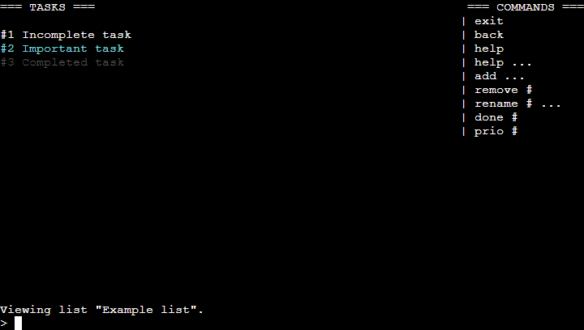
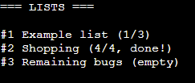
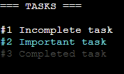
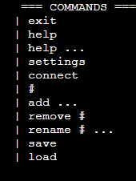
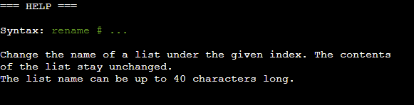
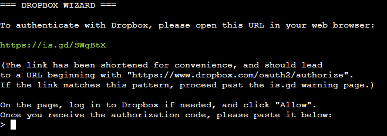
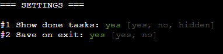
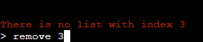

# Lists: a CLI to-do list manager

*Lists* is an interactive command-line program for creating and editing to-do lists, made for [Code Institute](https://codeinstitute.net)'s 3rd submission project. The lists can be synchronized with Dropbox for persistence.

Live version is available [here](https://tearnote-lists.herokuapp.com).

## Important notes

Type `help` to get info about the basic usage.

By default, your lists are not saved anywhere, and will disappear on page refresh. To keep your lists, run the `connect` command to link with Dropbox. This will enable the `save` and `load` commands, as well as autosave on `exit`.

The Dropbox account link, as well as your settings, are not saved. As such, the `connect` command must be run at every startup. For details, see the [bugs](#bugs) section.

The documentation is split across three files:

-   [README.md](README.md) (this file): Overview of the app. Read this to get an idea of the feature set, technologies used and project conventions.
-   [DESIGN.md](doc/DESIGN.md): UX design notes crafted during early stages of development. The design process is described entirely, from the concept and market research to data modelling.
-   [TESTING.md](doc/TESTING.md): Testing procedures. The app has been automatically validated and manually tested with procedures noted down in this file.

## Highlights

The app starts showing all available lists, with their progress summary.

The task view shows all tasks in the list, colored by their state.

The sidebar shows the list of all commands that are available right now.

Help text is available for every command.

The Dropbox connection wizard guides the user through the steps of setting up cloud sync via OAuth.

User-adjustable settings to customize app behavior.

Graceful and helpful handling of incorrect inputs.

## Technologies

-   Python
    -   Idiomatic Python 3 source organized with classes and modules,
    -   Error handling via exceptions,
    -   PEP 8 compliant,
    -   Minimal dependencies,
    -   Serialization to/from JSON,
    -   Communication with web services via API libraries and OAuth.

Directory structure

-   `/` (root): `README.md`, Python sources, environment configuration
-   `doc`: Additional Markdown files, PNG images used by Markdown files, any additional documentation files

The project includes the Code Institute-provided web terminal, written on Node.js. All the HTML, CSS and Javascript files belong to it.

## Deployment

Lists is a TUI application, but it's currently configured to run in the Code Institute web terminal environment. You can deploy it via the following steps:

1.  Fork the repository,
2.  Create a Heroku app (or equivalent) from the repository,
3.  Add the following buildpacks to the Heroku app, in this order:
    1.  `heroku/python`,
    2.  `heroku/nodejs`,
4.  Add a config var with key `PORT`, value `8000`,
5.  Create an app in the [Dropbox app console](https://www.dropbox.com/developers/apps),
6.  Configure the app with App Folder storage, and the following scopes:
    -   `account_info.read`,
    -   `files.metadata.write`,
    -   `files.metadata.read`,
    -   `files.content.write`,
    -   `files.content.read`,
7.  Copy the App key from the Dropbox app console, and add it as a config var value in Heroku, with key `APP_KEY`.

## Bugs

-   **App does not save user settings or Dropbox access tokens**  
    Because of the project requirements, this app needs to be usable in the Code Institute web terminal environment. This makes some features unfeasible to implement. For example, since it does not expose user-local storage such as browser cookies or local filesystem, it's not possible to save the settings and Dropbox access tokens securely. To make the app usable for desktop use, compatibility with the web terminal would need to be dropped.
-   **Console size is hardcoded to 80x24**  
    Size of the console is locked to the size available in the web console. To be compatible with all sorts of desktop terminals, the size would need to be queried with a syscall. The app is already "responsive", so querying the size would be enough.

## Attribution

All external code is attributed inline.

Libraries used are:

-   [colorama](https://pypi.org/project/colorama/), for portable terminal colors, used under MIT license,
-   [dropbox](https://pypi.org/project/dropbox/), for cloud storage of lists, used under MIT license,
-   [gdshortener](https://pypi.org/project/gdshortener/), for shortening the Dropbox OAuth link, used under LGPL license.
