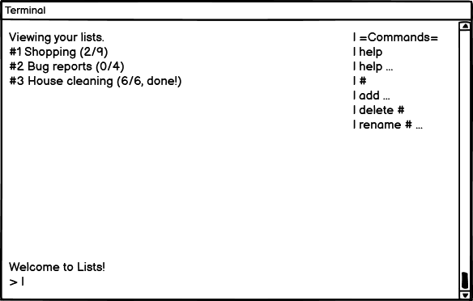
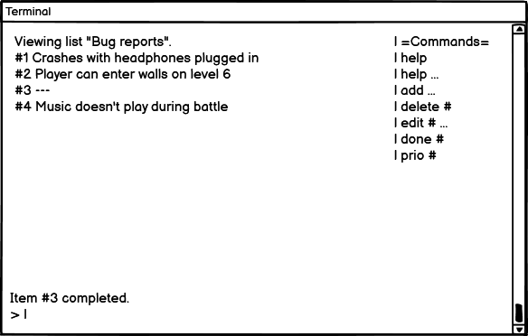

# Lists - UX design notes

## Motivation

Most people use to-do lists - it's a ubiquitous concept. They take various forms, like shopping lists, post-it notes or unread emails. Ensuring that you have easy access to any number of lists, anywhere you are, can be a great productivity boost, or even just help with daily life. 

## Market research

The majority of people settle on the note-taking apps in their phones, but some dedicated apps exist that have extra functionality. Here are a few examples:

   - [OneNote](https://www.microsoft.com/en-us/microsoft-365/onenote/digital-note-taking-app), the note-taking app from Microsoft's Office suite,
   - [Listonic](https://listonic.com), a shopping list app for mobile,
   - [Google Tasks](https://play.google.com/store/apps/details?id=com.google.android.apps.tasks), an Android to-do list app by Google,
   - [ColorNote](https://play.google.com/store/apps/details?id=com.socialnmobile.dictapps.notepad.color.note), an Android app for taking colorful notes on the go.

Many of these allow taking notes of any kind, not just lists of tasks. They commonly save the lists to online storage, allowing multiple people to access the lists, or to access them from multiple devices. Aside from that, they are often intentionally low on bells and whistles - the developers realize that with note-taking, ease and speed of use are king.

## User stories

> *As a busy adult, I want to write down my tasks so that I don't forget to do anything.*

-   How do I add an item?
-   How do I mark an item as completed?
-   Can I create multiple lists?
-   Are my lists being backed up somewhere?

## Scope

The goal is to make a CLI application that will make lists editing quick and friendly. This means it should take as little input as possible for the user to do what they're looking for, and they should receive constant feedback on the state of their lists.

These goals are necessary for an MVP of the app:

-   An overview of saved lists at startup,
-   Badge next to each list showing how much of the list is already completed,
-   Text input with a short command for each possible task,
-   General help, as well as per-command help and usage hints,
-   Input validation to ensure a command is valid,
-   Example of correct syntax shown if the user seems confused,
-   A side panel listing available commands,
-   Status line above the prompt giving feedback on the result of the last command,
-   Support for multiple storage backends - both local and remote,
-   Automatic saving and loading of lists to storage.

These additional goals are not necessary but would improve user experience if added:

-   Multiple remote backends, such as Dropbox, database, SFTP etc.,
-   Locally stored settings to customize behavior:
    -   Save on any change or on exit?
    -   Show completed tasks?
    -   Credential input for remote storage methods,
    -   Disable command reference panel,
-   Storage status screen, to show which storage backends are up-to-date and which are failing to update.

## Structure

As an interactive CLI application, UX will necessarily be driven by a state machine. Each state will display only the relevant information, allowing the user to focus on their task.

The start-up state will display an at-a-glance view of all the user's lists. This will allow them to immediately see what category of items has tasks to do, or to locate the list they want to modify.

The list state will detail all the items in a single list. From there, the user can add items, remove them, modify them, mark them as completed, or emphasize them as important.

At all times, the user is able to input commands at the bottom of the screen, following a prompt symbol. Above the prompt is a status line, confirming the success of the previous command or informing them of an error with their previous command.

For reference, a list of all available commands will be displayed on the right side of the screen, making the user aware of their choices.

## Data model

The data handled by the app is inherently hierarchical - the user owns a notebook, which contains multiple lists, which contain multiple task. For this reason, it was natural to model them as `Notebook`, `List` and `Task` classes, connected via composition.

All of these classes can convert themselves to/from a dict for the purpose of JSON serialization. They are also convertible to `str` for rendering.

### Task

This class represents a single task entry. The task name is encapsulated together with its current done/prio state.

### List

A List has a name, and contains multiple Tasks. Coloring each task according to its state happens here, because only the list is aware of each task's index, and we want the index to be colored too.

### Notebook

Notebook is a collection of Lists. It can be serialized/deserialized as a whole.

### TUI

Represents the Terminal User Interface of the program. Handles rendering and user input. Holds the current state of the app - which screen is currently shown.

### UserInput

Handles sanitization and conversion of user input from the original string to split command keyword and parameters. 

### Command, CommandList

Command contains everything needed for a command to be defined, validated and executed. CommandList contains Commands, and can dispatch the user input to the right command. Each state has its own CommandList.

### Config

Manages user settings, allowing for validated read/write access.

### Storage

Handles Dropbox connection and upload/download of string data.

## Wireframes

## Design language

As a CLI application, there isn't much that can be done about the visuals, but the UX can still be made clearer with some smart choices. To edit any element of a list, the user has to input a number as position in the list. For this purpose, an item index will always be referred to using the "#" character, both at the actual item site and the help text, as in the [wireframes](#wireframes) above. The string "..." refers to an additional argument, usually the name of the item.

Color will be used sparingly to direct attention towards important text, such as errors and manually emphasized entries.

Line/box drawing characters will also be used sparingly. For the most part the layout should be obvious without them as the number of elements on the screen is fairly minimal.
