# Lists - testing notes

## Validation

The Python code was developed with continuous PEP 8 validation, and produces no warnings.

## Testing

The code produces text with every interaction, so every class and function could be validated automatically with unit tests. However, project time didn't permit to write them alongside the code. Instead, the manual testing procedures will be described below.

### UI state and display layout

Procedure:

1.  Start the app and observe the initial screen,
2.  Enter a list with a list index ("1" command),
3.  Observe the task view layout,
4.  Return back to list view with the "back" command,
5.  Enter the settings with the "settings" command,
6.  Observe the settings layout,
7.  Type in "exit".

Expected:

State change commands enter the correct screens. "exit" stops the app with no way to continue other than restarting it. The layout is clear, and no text is overwritten by overlap, regardless of what content is created by the user.

Actual:

#1

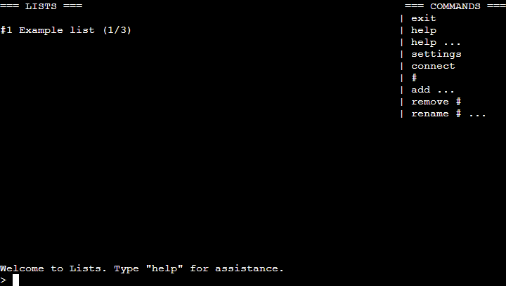

#2, #3

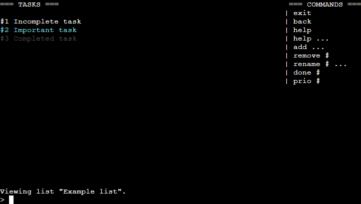

#4, #5, #6

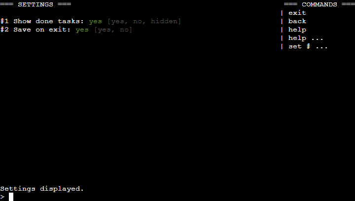

#7

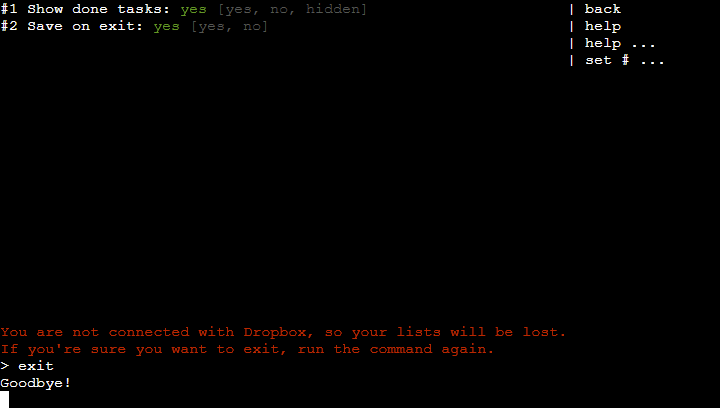

The commands work as expected, and the layout is clear and correct.

### Command processing

Procedure:

1.  Try to execute a command with too many parameters (such as "exit foo",)
2.  Try to execute a command with missing parameters (such as "rename 1",)
3.  Try to execute a command with non-integer index (such as "remove foo",)
4.  Try to execute a command with index out of range (such as "remove 999",)
5.  Try to execute a command in the context where it doesn't exist (such as "load" in task view,)
6.  Try to execute an empty command.

Expected:

All of the above checks return a clear error message in red above the prompt, and allow the user to continue using the app.

Actual:

#1

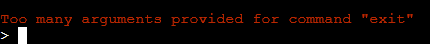

#2

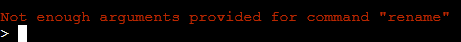

#3

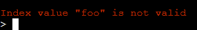

#4

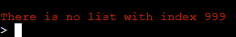

#5

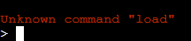

#6

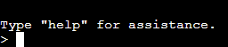

The errors are returned as expected.

### List management

Procedure:

1.  Add a new list with the "add" command,
2.  Rename a list with the "rename" command,
3.  Remove a list with the "remove" command,
4.  Try to add too many lists to fit in the layout.

Expected:

The above commands have their obvious result.

Actual:

#1

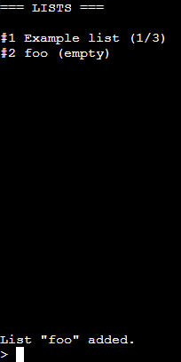

#2

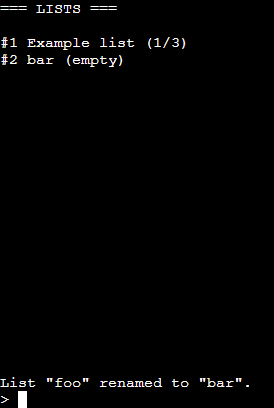

#3

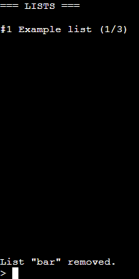

#4

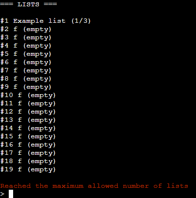

The commands are working correctly.

### Task management

Procedure:

1.  In list view, add a task with the "add" command,
2.  Rename a task with the "rename" command,
3.  Remove a task with the "remove" command,
4.  Mark a task as done with the "done" command,
5.  Unmark a done task with the "done" command again,
6.  Mark task as priority with the "prio" command,
7.  Unmark a task as priority with the "prio" command again,
8. Try to add too many tasks to fit in the layout.

Expected:

The above commands have their obvious result.

Actual:

#1

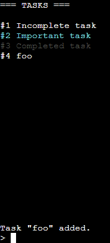

#2

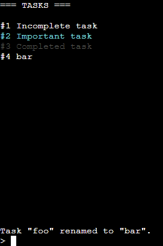

#3

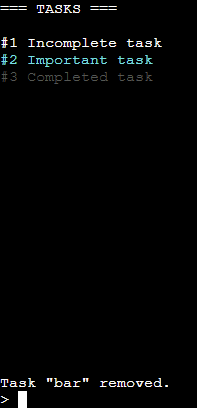

#4

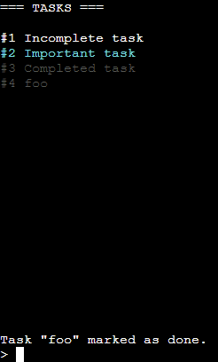

#5

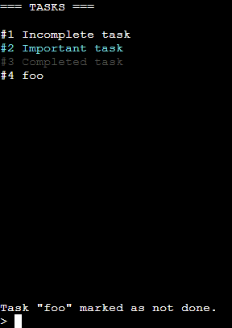

#6

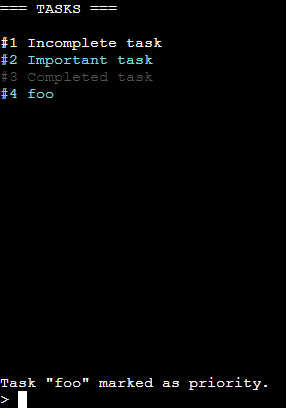

#7

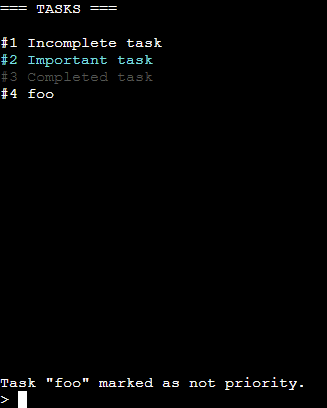

#8

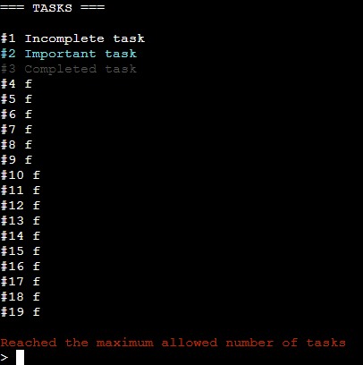

The commands are working correctly.

### Help command

Procedure:

1.  Type in "help" to show general help,
2.  Exit the help screen with any input,
3.  Type in "help add" to show help about a specific command,
4.  Exit the help screen again,
5.  Type in "help foo". 

Expected:

Help text appears correctly, doesn't need scrolling or break the layout of the result text and prompt sticking to the bottom edge. Help for a nonexistent command displays a clear error message.

Actual:

#1

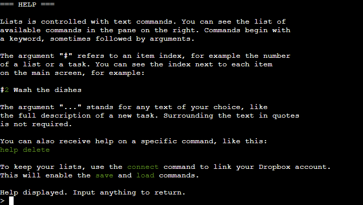

#2, #3

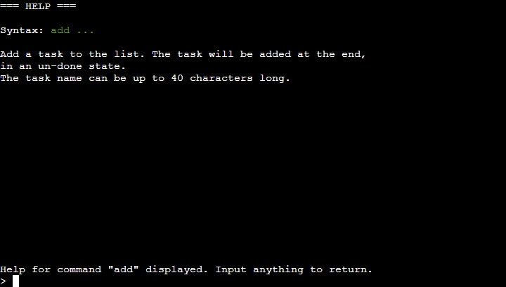

#4, #5

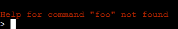

Help text is shown and commands work as expected.

### Settings

Procedure:

1.  In the settings, type in "set 1 foo",
2.  Type in "set 3 foo",
3.  Set "show done tasks" to "hidden" with "set 1 hidden",
4.  Leave settings and confirm that done tasks are now displayed as "===".

Expected:

Settings are shown and can be modified with the "set" command. The change has immediate effect. An error message is thrown if the index or the value are invalid.

Actual:

#1

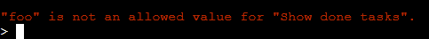

#2

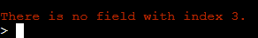

#3

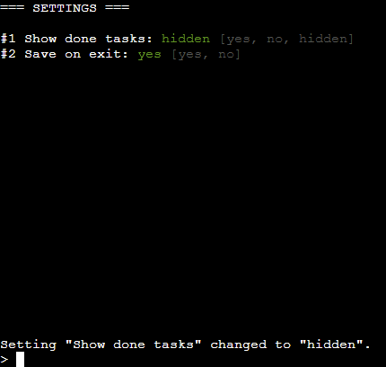

#4

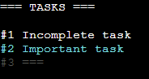

Commands are working as expected.

### Dropbox integration

Procedure:

1.  Type in "connect",
2.  Type in "foo" as the authorization code,
3.  Type in "connect" again and follow the account linking procedure according to screen instructions,
4.  Type in "save",
5.  Remove a list,
6.  Type in "load".

Expected:

Dropbox account link is functional, and displays an error in case of failure. Successful linking enables the "save" and "load" commands. The commands upload and download data from Dropbox, respectively.

Actual:

#1

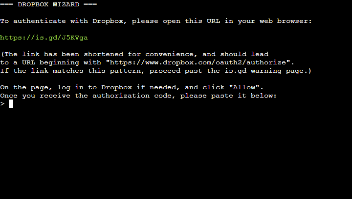

#2

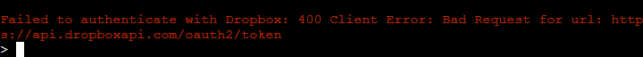

#3

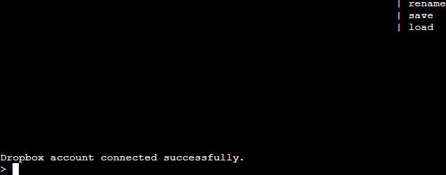

#4

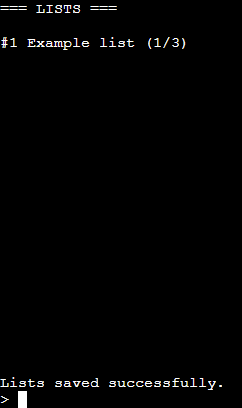

#5

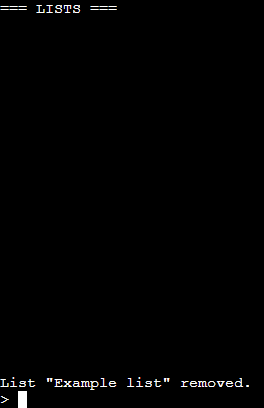

#6

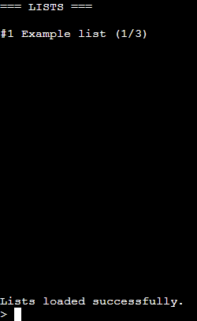

Dropbox functionality works correctly as expected.

## User stories study

In the design phase, we [established](DESIGN.md#user-stories) the expected user-base and what kinds of questions they might have when using the app. We will check if their questions are answered by the completed project.

| Question                                | Answered? | How?                                                                                                                             |
|-----------------------------------------|-----------|----------------------------------------------------------------------------------------------------------------------------------|
| How do I add an item?                   | Yes       | Answered by the sidebar listing the "add" command in list view, and help functionality.                                          |
| How do I mark an item as completed?     | Yes       | Same as above, with "done" command in task view.                                                                                 |
| Can I create multiple lists?            | Yes       | Yes, implied by the existence of the "add" command in list view.                                                                 |
| Are my lists being backed up somewhere? | Yes       | Answered by the exit command warning if Dropbox isn't connected, urging the user to make the connection and back up their lists. |
